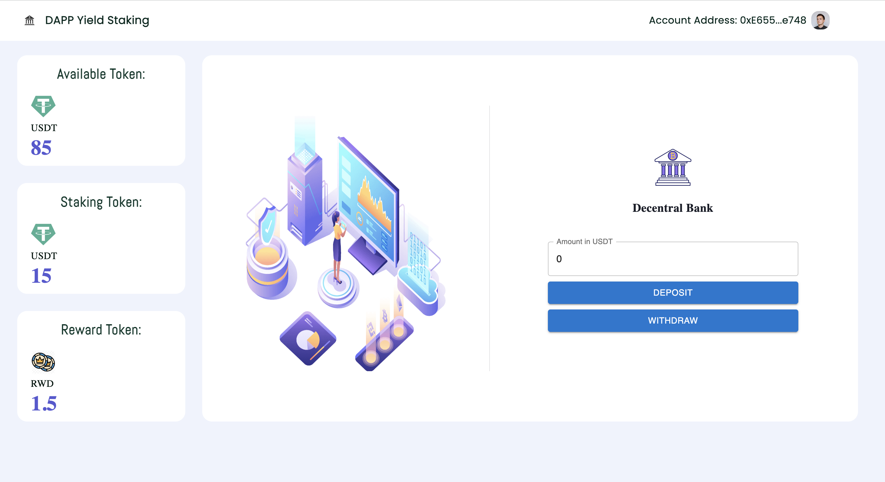
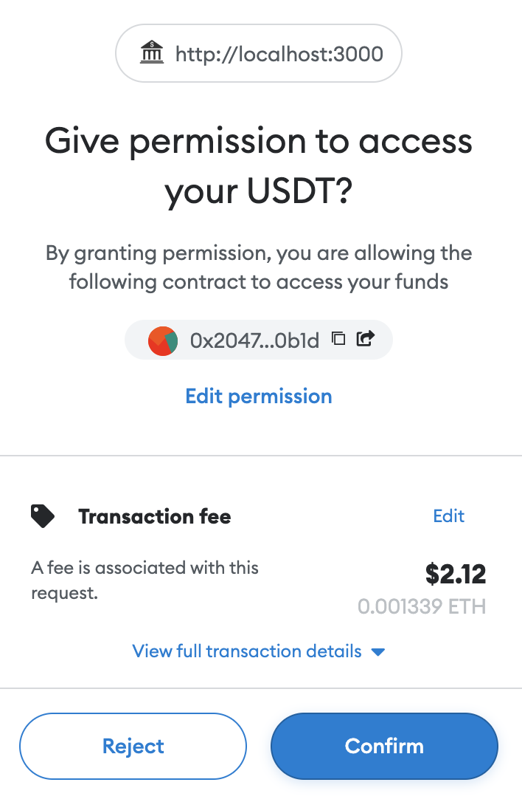

# Defi Staking App

Defi Stake App is a simple application that allows users to stake their tokens and earn rewards. UI is built with React and the smart contracts are written in Solidity. Application has clean and simple UI that allows users to stake and unstake their tokens. Users can also check their balance and rewards. Application is responsive and works on all devices.

## UI


## To use this application

1. Deposit tokens functionality
    
    - User can deposit token to decentral bank if they have enough token balance.
    - Add the amount of token to deposit and click on deposit button. It redirect to the transaction page of metamask. 
     </img>
    - Confirm the transaction and wait for the transaction to be mined.
     </img>
    - Reload the page to see the updated balance.

2. Withdraw tokens functionality

    - User can withdraw token from decentral bank if they have enough staking balance.
    - Click on withdraw button. It redirect to the transaction page of metamask. Confirm the transaction and wait for the transaction to be mined.
    - Reload the page to see the updated balance.

3. Available Balance

    - User can see their available balance of token in their wallet. 
    - This balance is in USDT currency.

4. Staking Balance

    - User can see their staking balance of token in their wallet. 
    - Staking Balance is the amount of token that user has deposited in the decentral bank.
    - This balance is in USDT currency.

5. Rewards Balance

    - User can see their rewards balance of token in their wallet. 
    - Rewards Balance is the amount of token that user has earned by staking their token in the decentral bank.
    - This balance is in RWD currency.
    

## **To run this application (useful commands)**

1. install all dependencies
    
    ```jsx
    npm install
    ```

2. compile contracts
    
    ```jsx
    truffle compile
    ```

3. migrate contracts on the blockchain
    
    ```jsx
    truffle migrate --reset
    ```

4. run Moch and Chai testing suite
    
    ```jsx
    truffle test
    ```

5. run the script by truffle
    
    ```jsx
    truffle exec scripts/{filename}.js
    ```

6. run the frontend
    
    ```jsx
    npm run start
    ```

